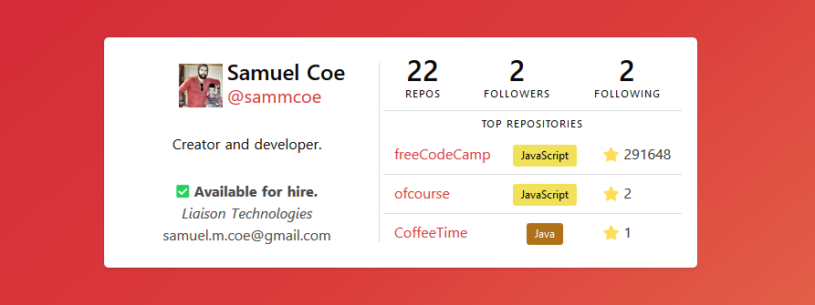

# github-vue
This is a Vue component for displaying a GitHub user's info and statistics in a Vue application.
Styled using Bulma, this provides a lightweight, simple component for quickly adding GitHub user information to a website.

## Installation
`npm install github-vue`

## Usage
Placing the component into a Vue application is as simple as importing it:
`import GithubVue from 'github-vue'`
and adding the tag:
`<github-card/>`

## Options
The Gihub Vue component currently supports several options, that can bee added as attributes to the component tag.
For Example:
`<github-card
  :token="token"
  vertical
  avatar
  hireable
  company
  email
  bio/>`
  
### token
**token** is the only **mandatory** attribute, and must be passed a GitHub personal access token for the component to retrieve the necessary user data.  It is recommended that this token be used as an environment variable or stored in a configuration file within your project and that the configuration file is added to your `.gitignore` to avoid accidentally publishing it.  Instructions for generating a token can be found [here](https://help.github.com/articles/creating-a-personal-access-token-for-the-command-line/).

### vertical
**vertical** does exactly what it sounds like-- it enables the component vertical mode.

### avatar
**avatar** will display the GitHub user's avatar-- omitting this value will hide it.

### hireable
**hireable** will display the GitHub user's hireable status-- omitting this value will hide it.

### company
**company** will display the GitHub user's company-- omitting this value will hide it.

### email
**email** will display the GitHub user's email-- omitting this value will hide it.

### bio
**bio** will display the GitHub user's bio-- omitting this value will hide it.
